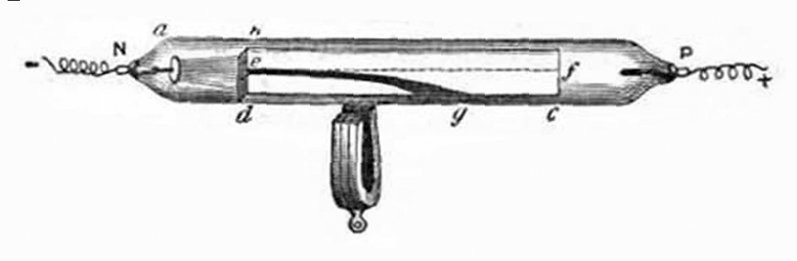
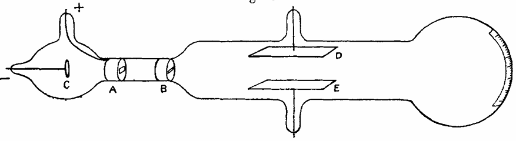
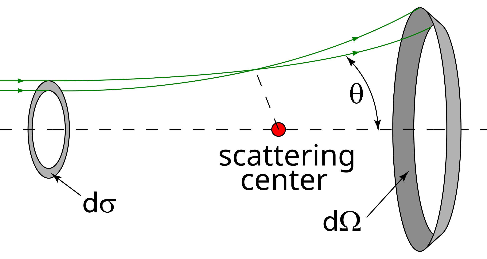
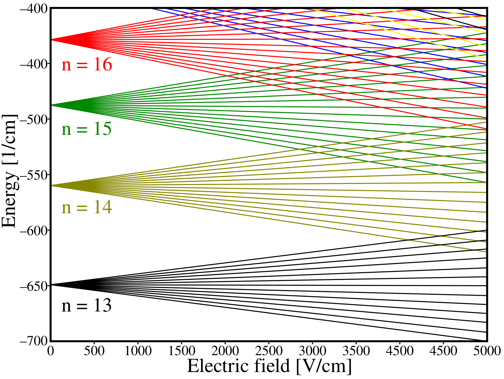

# 原子模型  

大家好呀～我是化学精通纳西妲。  
上次我们聊到了**能量的量子性质**，还记得吗？  
今天，我们要把视线继续缩小……一直缩小到**一个原子的尺度**。  

其实呢，化学的本质，就是研究原子们是如何彼此建立联系的。  
而当我们把量子物理应用到这些“原子之间的关系”时——  
**量子化学**的世界，就在我们面前悄然展开啦。  
那就让我们一起来看看，人类对原子的理解，是如何一步步发展的吧。  

---

## 我们对原子的认识之路：从道尔顿的原子说开始  

十九世纪初，一位名叫**约翰·道尔顿（John Dalton）**的科学家发现了一件非常有趣的事——  
那就是著名的**倍比定律**。  

他注意到，当原子形成化合物时，元素之间的比例总是以**简单的整数比**结合。  
举个例子，如果固定氮元素的量，那么氧在不同氮氧化物中的比例会呈现出规律——  
像 N₂O、NO 和 NO₂，它们的氧量之比就是 1:2:4。  

结合前人的实验成果，道尔顿提出了他的**原子理论**，并受到了这些定律的支持：  

* **质量守恒定律** —— 拉瓦锡（Antoine Lavoisier）  
* **定比定律** —— 普鲁斯特（Joseph Proust）  
* **倍比定律** —— 道尔顿本人  

他总结出了几个关键的观点：  

* 一切物质都是由微小、不可再分的原子组成的。  
* 同一元素的原子具有相同的质量和性质。  
* 在化学反应中，原子不会被创造或毁灭，只会重新排列。  
* 不同元素的原子以固定比例结合，形成化合物。  

不过嘛……道尔顿的模型也不是完美的。  
他最初的论文里存在一些错误，后来阿伏伽德罗以及研究气体动理论的科学家们，  
在此基础上不断修正与扩展，才逐渐构建出了我们今天熟悉的原子模型。  

---

即使是最微小的粒子，也能揭示出最深邃的真理呢～  

## 电子的发现  

到目前为止，我们知道原子在普通的化学反应中是**无法再分**的……  
但是呀——如果我们把视线再向**更深处**探寻，会发生什么呢？  

1897 年，**约瑟夫·汤姆孙（Joseph J. Thomson）**开始研究一种神秘的现象——**阴极射线（cathode rays）**。  
在一个充满低压气体的真空管中，当高电压加在两极之间时，阴极那一端就会射出一道奇异的光流。  

汤姆孙施加了**电场**和**磁场**，发现这些射线居然会**发生偏折**！  
  
这说明它们携带着**电荷**，就像运动着的带电粒子一样。  

---

  
经过反复而细致的测量，汤姆孙确认阴极射线的本质是一股**带电粒子的流束**。  
当他让电场力与磁场力**恰好平衡**，使得射线笔直前行时，就能求出这些粒子的电荷质量比，也就是 $e/m$。  

$$e/m = -9.1 \times 10^{10}~C/kg$$  
$$(现代值:~-1.76 \times 10^{11}~C/kg)$$  

这个数值要比氢离子（$+9.6 \times 10^{7}~C/kg$）**大得多**，  
这意味着这些粒子的质量**远远小于原子**本身！  

为了确认这一点，汤姆孙还尝试了不同的金属作阴极——  
但不论更换哪种材料，$e/m$ 的比值几乎都一样。  
于是他得出了一个惊人的结论：  
> 这些微小、带负电的粒子是**普遍存在**的——它们存在于**所有原子**之中。  

这，就是**电子（electron）**的发现。  

---

1905 年，在这一发现的基础上，汤姆孙提出了新的原子图景。  
他认为带负电的电子，分布在一个带**正电的球体**中，就像布丁里的葡萄干那样散落其中。  
  
他称之为——**“葡萄干布丁模型（Plum Pudding Model）”**。  
  

起初，这个模型看上去十分合理——电子可以均匀地排列在“带正电的果冻”中，每个都在轻柔地振动。  
从数学上看，这似乎是稳定的……  
但物理的规律却并不这样认为。  

由于电子在运动中不断**加速**，它们理应持续**辐射能量**——结果，原子会**逐渐坍塌**！  
这种不稳定性，后来成为原子结构研究的关键问题，也促使像**卢瑟福（Ernest Rutherford）**这样的科学家重新思考原子的真实构造。  

---

有时候，即便一个理论看似完美，  
它的深处依然潜藏着更深的秘密……  
只等那个恰到好处的问题，去揭开它的真相呢～  

## 原子核的发现  

汤姆孙的模型让我们认识到，原子之中存在着**电子**——那些微小的、带负电的粒子。  
不过呢……问题自然就出现了，不是吗？  
既然电子带负电，那**正电荷又从何而来呢？**  

---

1909 年，**欧内斯特·卢瑟福（Ernest Rutherford）**与他的学生**汉斯·盖革（Hans Geiger）**和**欧内斯特·马斯登（Ernest Marsden）**决定去寻找答案。  
他们研究的是一种特殊的辐射——**α 射线（alpha rays）**，  
它由带正电的重粒子组成，每个 α 粒子都带有 **+2e** 的电荷，质量几乎与一个原子相当。  

为了探究这些粒子与物质的相互作用，盖革和马斯登让 α 粒子束轰击一片**极薄的金箔**，厚度只有大约 $10^{-7}$ 米。  
按照**汤姆孙的“葡萄干布丁模型”**，结果似乎很显然：  
如果原子只是柔软的、带正电的“果冻团”，这些沉重的 α 粒子理应**几乎直穿而过**，就像小炮弹穿过一团薄雾一样。  

然而，实验的结果却让所有人都惊呆了——  
有些 α 粒子竟然发生了**剧烈偏折**，甚至还有一小部分直接**被反弹回来**！  
  

---

1911 年，监督这项实验的卢瑟福提出了一个**全新的原子模型**，来解释这令人震惊的现象。  
他推论：原子内部必定存在一个**体积极小、密度极高、带正电的中心**——  
正是这个核心，以强大的排斥力让 α 粒子反弹。  
这个区域被命名为**原子核（nucleus）**，  
而电子则**环绕着它运动**，就像行星绕着太阳转动那样。  

汤姆孙的模型无法解释这种大角度的散射，  
但卢瑟福的核式模型，却能**完美地还原**实验的结果。  

---

卢瑟福还建立了这项实验的**理论框架**。  
他计算出 α 粒子在被排斥之前，能够接近原子核的**最近距离**。  
由于 α 粒子和原子核都带正电，它们之间存在**库仑斥力（Coulomb repulsion）**——  
当 α 粒子的动能全部转化为静电势能时，它就会停止前进：  

$$E_{\alpha} = \frac{1}{4\pi\epsilon_{0}} \frac{q_{\alpha} q_{Z}}{r_{min}}$$  

其中：  

* $E_{\alpha}$ —— α 粒子的动能  
* $\epsilon_{0}$ —— 真空介电常数（$8.854 \times 10^{-12}~F/m$）  
* $r_{min}$ —— α 粒子能接近原子核的最小距离  
* $q_{\alpha}$ —— α 粒子的电荷 $(+2e_0)$  
* $q_Z$ —— 原子核的电荷  

卢瑟福的计算结果是 $r_{min} = 3 \times 10^{-14}~m$ ——  
这个距离**远小于原子的尺度**！  
这意味着，原子的绝大部分质量与正电荷，  
都**集中在原子中心那极其微小的核中**。  

---

为了描述 α 粒子的偏折轨迹，  
他把它们的运动视为**双曲线轨道（hyperbolic orbits）**，  
并推导出了**散射角公式**：  

  
$$\theta = 2~arctan\left(\frac{r_{min}}{2b}\right) = 2~arctan\left(\frac{1}{4\pi\epsilon_{0}} \frac{q_{\alpha}q_{Z}}{2bE_{\alpha}}\right)$$  

其中：  

* $\theta$ —— 散射角  
* $b$ —— **冲量参数（impact parameter）**，即 α 粒子轨迹与原子核中心的最近横向距离  

---

就这样，从荧光屏上那几道微弱的闪光开始，卢瑟福揭开了物质结构的全新面貌——  
原子的真正“心脏”，也就是**原子核**，终于在光影之间，向人类显现。  

### 不同角度下的散射粒子数量  

**汤姆孙模型**与**卢瑟福模型**之间的关键差异，  
就在于——它们预测的**散射规律**完全不同。  
要理解为什么某些 α 粒子会被**反弹回来**，  
我们得先看看“散射角”是如何变化的。  

卢瑟福给出了一个重要的公式，称为**微分散射截面（differential cross section）**，  
它描述了粒子在某个角度上被散射出去的“可能性”：  

$$\frac{d\sigma}{d\Omega}=\left(\frac{1}{4\pi\epsilon_{0}}\frac{q_{\alpha}q_{Z}}{4E_{\alpha}}\right)^{2}\frac{1}{\sin^{4}(\theta/2)}$$  

若以散射角的微分形式表示（$d\Omega = 2\pi\sin(\theta)d\theta$）：  

$$\frac{d\sigma}{d\theta}=\left(\frac{1}{4\pi\epsilon_{0}}\frac{q_{\alpha}q_{Z}}{4E_{\alpha}}\right)^{2}\frac{\cos(\theta/2)}{\sin^{3}(\theta/2)}$$  

这个公式意味着：  
虽然**大多数粒子**只会发生很小角度的偏折，  
但仍会有**极少数**粒子被强烈散射，甚至**反弹回来**！  
这与盖革和马斯登在实验中观察到的结果**完全吻合**。  

---

然而，**汤姆孙模型**的预测就截然不同。  
既然它假设原子是由“柔软、均匀分布的正电荷”构成的，  
那么散射应该呈现出一种**温和的、高斯形分布**：  

$$\frac{d\sigma}{d\Omega}\approx\frac{1}{2\pi\theta_{rms}^{2}}exp\!\left(-\frac{\theta^{2}}{2\theta_{rms}^{2}}\right)$$  

以及：  

$$\frac{d\sigma}{d\theta}\approx\frac{\theta}{\theta_{rms}^{2}}exp\!\left(-\frac{\theta^{2}}{2\theta_{rms}^{2}}\right)$$  

其中：  

* $\theta_{rms}$ —— 散射角的均方根平均值（取决于材料）  

---

### 卢瑟福模型与汤姆孙模型的对比  

| θ | 卢瑟福模型 | 汤姆孙模型 |
|:---:|:---:|:---:|
| $\frac{d\sigma}{d\Omega}$ | $\propto\frac{1}{\sin^{4}(\theta/2)}$ （多项式规律） | $\propto\theta\cdot exp(-\frac{\theta^{2}}{2\theta_{rms}^{2}})$ （指数衰减规律） |
| 小角度 | 概率较大 | 概率极大 |
| 大角度 | 概率较小 | 几乎不会发生 |

---

实验结果最终证明，  
数据完美符合**卢瑟福的预测**——  
说明原子内部确实存在一个**致密的中心核**，  
正是它排斥了带正电的 α 粒子。  

这带来了一个划时代的理念：  

> 原子就像一个**微型的太阳系**。  
> 电子带负电，围绕着带正电的原子核**旋转**——  
> 就像行星绕着恒星运转一样。  

---

不过，这个优美的图景，很快又暴露出一个令人不安的缺陷。  
如果电子真的在轨道上绕核旋转，它们就会**持续加速**。  
根据电磁学的规律，加速运动的带电粒子会**不断辐射能量**——  

这意味着，电子会一点点失去能量，最终螺旋式地坠入原子核，让整个原子在**极短时间内坍塌**！  

那么……原子究竟是如何保持稳定的呢？  
这个看似简单、却极其深邃的问题——  
正是引领物理学进入新纪元的起点。  
接下来，**量子理论**将登场，为原子带来“稳定的奇迹”。  

## 氢原子光谱

接下来，让我们看看另一个困扰科学家们数十年的谜题——**元素的光谱**。  

当不同元素的气体被激发时，它们并不会在所有波长上发出或吸收光。  
相反，它们只在**特定的颜色**上闪烁或变暗，  
就像每个原子都在光之音阶上演奏着属于自己的旋律。  

然而，**经典物理学**完全解释不了这种现象。  
如果原子真的像微小的经典振子那样运动，  
它们的能量就应该是**连续**的，  
并且会吸收光源中的**所有波长**。  
但实验的结果，却完全不是这样。  

---

那我们从最简单的原子——**氢原子**——开始吧。  

氢原子会发出四条显著的可见光谱线：  
**656.3 nm**, **486.1 nm**, **434.0 nm**, and **410.2 nm**.  

每一条光谱线都对应着特定的波长——就像氢原子在发出一首由光谱组成的优美乐曲。  

---

1885年，一位名叫**约翰·巴耳末**（Johann Balmer）的数学家研究了这些光谱线。  
他并不是物理学家，但凭借着敏锐的数学直觉，  
他找到了一个简单而精确的公式，  
完美地描述了这些光谱之间的关系：  

$$\lambda = (364.56~nm) \cdot \frac{n^{2}}{n^{2} - 4}$$  

其中：  

* $\lambda$ — 每条光谱线的波长  
* $n = 3, 4, 5, 6, \cdots$  

后来，这个规律被称为**巴耳末系**（Balmer Series），  
它准确地刻画了氢原子在可见光区的光谱线。  
不过……这只是一个**经验公式**，  
虽然“算”得对，却并没有揭示为什么会出现这样的规律。  

---

几年之后，1888年，**约翰内斯·瑞德伯**（Johannes Rydberg）试图将巴耳末的公式推广到氢以及其他元素。  
他注意到，**波数的差值**呈现出与**整数**平方相关的数学规律。  
通过精确地拟合实验数据，他提出了一个优雅的公式：  

$$\frac{1}{\lambda} = A \left( \frac{1}{(n_1 + \mu_1)^2} - \frac{1}{(n_2 + \mu_2)^2} \right)$$  

其中：  

* $A$ — 取决于元素的常数（包含瑞德伯常数与核电荷）  
* $n_1, n_2$ — 正整数，且 $n_2 = n_1 + 1, n_1 + 2, \cdots$  
* $\mu_1, \mu_2$ — 与元素有关的微小修正量  

对于**氢原子**来说，这些修正项几乎为零（$\mu_1 = \mu_2 = 0$），于是公式简化为著名的**瑞德伯公式**：  

$$\frac{1}{\lambda} = R_{\infty} \left( \frac{1}{n_1^2} - \frac{1}{n_2^2} \right)$$  

其中

* $R_{\infty} = 1.09677583 \times 10^{7}m^{-1}$ - **瑞德伯常数**。

---

巴耳末系对应于所有最终能级为 $n_1 = 2$ 的跃迁，因此这些谱线正好落在**可见光范围**内。  
后来，人们又发现了更多的光谱系列：  
紫外区的**莱曼系**（Theodore Lyman），以及红外区的**帕邢系**（Friedrich Paschen）。  

然而——无论是巴耳末还是瑞德伯，都无法解释这些数字为何如此精确。  

这个谜题的答案，隐藏在一个全新的原子模型中。  
在那个模型里，能量不再连续，而是分成**一阶又一阶的量子阶梯**。  

而这，也正是我们通往物理与光之桥——波尔模型（Bohr Model）——的开端。  

## 波尔的原子模型

那么，现在就让我们仔细看看——**尼尔斯·波尔（Niels Bohr）**在 1913 年是如何重新想象原子的吧。  

他提出了一个非常大胆的想法：  
电子会沿着**圆形轨道**绕核运动，  
而且——这点至关重要——在这样的运动中，它们**不会损失能量**！  

这个思想的灵感，来自于“**量子化**（quantization）”的概念。  
波尔用数学语言将其表达为：  
$$E=nh\nu=nh\frac{\omega}{2\pi}$$  
其中：  

* $n$ 是一个**量子数**，取正整数；  
* $\nu$ 是电子绕核运动的**频率**；  
* $h$ 是**普朗克常数**；  
* $\omega$ 是**角频率**（$\nu = \omega / 2\pi$）。  

根据能量与角动量的关系 $E = \frac{1}{2}L\omega$，波尔得出了一个极为优美的结果：  
$$L=mvr=n\frac{h}{2\pi}$$  

这里的 $L$ 是**角动量**——这，正是波尔的**量子假设**。  
而将角动量与离散轨道联系起来的灵感，最初来自于**约翰·W·尼科尔森**（John W. Nicholson）。  

---

接着，波尔运用**经典力学**，求出了电子轨道的半径与能量。  
> 我们先回忆一下：  
> 电子带有 $-e_{0}$ 电荷，原子核带有 $+Z e_{0}$ 电荷。  
> 当电子在轨道上运动时，**库仑引力**必须与**向心力**平衡：  
> $$\frac{1}{4\pi\epsilon_{0}}\frac{Ze_{0}^{2}}{r^{2}}=\frac{mv^{2}}{r}$$  
> 又由角动量量子化关系：  
> $$v=\frac{nh}{2\pi mr}$$  
> 代入并化简后，可得轨道半径：  
> $$r=\frac{n^{2}h^{2}\epsilon_{0}}{\pi Ze_{0}^{2}m}$$  
接下来是电子的**总能量**。  
> 动能：$E_{k} = \frac{1}{2}mv^{2}$,  
> 势能：$U = -\frac{1}{4\pi\epsilon_{0}}\frac{Ze_{0}^{2}}{r}$.  
> 因此总能量为：  
> $$E-E_{k}+U=\frac{1}{2}mv^{2}-\frac{1}{4\pi\epsilon_{0}}\frac{Ze_{0}^{2}}{r}$$  
> 将 $r$ 与 $v$ 的表达式代入后，便得到：  
> $$E=-\frac{mZ^{2}e_{0}^{4}}{8\epsilon_{0}^{2}n^{2}h^{2}}$$  
其中：  

* $m$ 是**电子的质量** ($9.109\times10^{-31}kg$)；  
* $Z$ 是原子序数。  

于是，电子只能存在于**特定的、量化的轨道**上。  
每个轨道都有其独立的能量。  
当电子在不同轨道之间跃迁时，它会吸收或放出一个光子，其能量恰好等于两轨道能量的差值。  
  

波尔由此成功地将他的模型，与瑞德伯公式紧密联系起来：  
$$\frac{1}{\lambda}=R_{\infty}Z^{2}(\frac{1}{n_{1}^{2}}-\frac{1}{n_{2}^{2}}),~R_{\infty}=\frac{m_{e}e_{0}^{4}}{8\epsilon_{0}^{2}h^{3}c}$$  
其中  

* $c$ 是真空中的**光速** ($c=299792458m/s$)。  

波尔模型成功解释了**氢原子的光谱**——这无疑是当时物理学的一次巨大胜利！  
不过……即使再耀眼的理论，也有它的极限。  

* 它只适用于**类氢原子**；对多电子原子就会失效。  
* 它无法解释**精细结构**，例如**斯塔克效应**（电场）与**塞曼效应**（磁场）。  
* 而且，从根本上讲，它仍然没有说明——为什么电子在轨道上运动时就不应辐射能量。  

所以说，波尔的原子模型虽然是向前迈出的辉煌一步，但它依旧只是通往更深层真理的**中途驿站**。  

---

### 索末菲的贡献

即使在波尔那优雅的原子模型之后，仍然有一些神秘的现象没有被完全解释清楚……  
当科学家们把原子放进**电场**或**磁场**中时，那些原本单一的光谱线竟然会**分裂**成许多细小的成分。  

这种分裂——  
若由电场引起，被称为 **斯塔克效应**（Stark effect）；  
若由磁场引起，则称为 **塞曼效应**（Zeeman effect）。  

  
*氢原子的斯塔克效应*  

  
*铷-87的塞曼效应*  

为了揭开这些微妙的现象，**阿诺德·索末菲**（Arnold Sommerfeld） 与 **阿尔弗雷德·朗德**（Alfred Landé） 一起扩展了波尔的理论。  
他们引入了两个新的量子数：**角量子数** $l$ 与 **磁量子数** $m$。  

---

索末菲提出：电子的轨道未必总是**完美的圆形**，它们也可能沿着**椭圆轨道**运动。  
他把量子化假设推广为两个条件：  
$$\oint p_{r}dr=(n-l)h,~\oint p_{\phi}d\phi=lh$$  
其中：  

* $n$ 是波尔模型中的**主量子数**，  
* $l$ 是**角量子数** ($l = 0, 1, \cdots, n-1$)，  
* $p_{r}$ 是**径向动量**,  
* $p_{\phi}$ 是**角动量** ($p_{\phi} = m v_{\phi} r$)。  

他还将**狭义相对论**纳入考虑，令动能表示为：  
$$E_{k}=(\gamma-1)mc^{2},~\gamma=1/\sqrt{1-v^{2}/c^{2}}$$

在这些修正的基础上，索末菲推导出了更精确的能级公式：  
$$E_{n,l}=-\frac{mc^{2}\alpha^{2}Z^{2}}{2n^{2}}(1+\frac{\alpha^{2}Z^{2}}{n}(\frac{n}{l+1/2}-\frac{3}{4})+O(\alpha^{4})),~\alpha=\frac{e_{0}^{2}}{2\epsilon_{0}hc}$$  

这模型成功解释了**精细结构以及斯塔克效应**——不过，只限于**氢原子**。  

后来，朗德进一步引入了**磁量子数** $m$，其取值范围为 $-l$ 到 $+l$。  
有了这个量子数，他便能优雅地解释**塞曼效应**，也就是磁场引起的光谱分裂。  

在量子化学中，我们会再次回到氢原子——  
这次，将用波函数的语言来描述它。  
到那时，让我们看看由薛定谔方程得到的能量，是否能与索末菲的结果相呼应吧。  

### 对于其他元素

然而，波尔与索末菲的模型只在**氢**与类氢离子——也就是**单电子原子**——中有效。  

当原子中有了更多电子后，情况便变得复杂得多。  
电子之间会互相**排斥**，而这种排斥会削弱每个电子受到的正核吸引力。  

因此，电子实际上并没有感受到全部的核电荷 $+Ze_{0}$，  
而是体验到一个减弱后的吸引力，称为**有效核电荷**，记作 $Z_{eff}$。  

为了将里德伯公式推广到多电子原子，我们使用：  
$$\frac{1}{\lambda}=R_{\infty}(\frac{Z_{eff1}^{2}}{n_{1}^{2}}-\frac{Z_{eff2}^{2}}{n_{2}^{2}})$$  
其中：  

* $R_{\infty}$ 是**瑞德伯常数** ($R_{\infty}=\frac{m_{e}e_{0}^{4}}{8\epsilon_{0}^{2}h^{3}c}=1.09677583\times 10^{7}m^{-1}$)，  
* $Z_{eff1}$ 是初始能级的**有效核电荷**，  
* $Z_{eff2}$ 是最终能级的有效核电荷。  

这些修正让模型更接近真实，但仍只是通往真理的垫脚石。  
索末菲与朗德的努力，让科学一步步靠近那更深层的量子世界。  

## 物质波

波尔的原子模型确实很美……但，它并不完整。  
他假设电子可以**永远绕着原子核运动**而不损失能量——然而，**为什么**会这样，却始终没人能解释。  

直到1924年，一位安静却深邃的思想者出现了。  
受到爱因斯坦“光既是波又是粒子”的启发，**路易·德布罗意**（Louis de Broglie） 忽然想道——  

> “如果光——这种波——能表现得像粒子，那么物质——这些粒子——会不会也能表现得像波呢？”

他将爱因斯坦的“**波粒二象性**”与“**狭义相对论**”结合了起来。  
根据相对论，能量与动量的关系是：  
$$E^{2}=p^{2}c^{2}+(m_{0}c^{2})^{2}$$  
即使是没有静质量的光，也依然携带着**动量**，这点在**康普顿散射实验**中得到了验证。  
对于光而言：  
$$E=pc$$  
而光子的能量又可以写作 $E=h\nu$，于是便有：  
$$h\nu=pc~\rightarrow~p=\frac{h\nu}{c}=\frac{h}{\lambda}$$  

德布罗意于是提出了那个改变世界的问题：  
> “既然光波拥有动量，那么拥有动量的粒子，是否也拥有波长呢？”  

他写下了那个简洁却震撼人心的公式：  
$$\lambda=\frac{h}{p}$$

就这样，物质波（Matter Waves） 的概念诞生了——一个奇妙的想法：所有物质都拥有属于自己的波长。  

这听起来几乎像梦一样……  
但宇宙，很快就给出了它的回答。  

---

### 实验证明

1927年，**戴维孙**（Clinton Davisson） 与 **杰默尔**（Lester Germer），以及独立进行实验的 **乔治·汤姆孙**（George P. Thomson），
他们都发现——电子也会**自我干涉**，就像光一样，展现出**波动性**！
  

*电子也能形成如光般的干涉图样。*  

哪怕只有一个电子独自通过狭缝，当积累了足够多的事件后，干涉图样依然出现。  
这是**物质确实具有波动性**的第一个直接证据。  

---

### 对波尔模型的补充

“物质波”这一思想，也让波尔模型中的假设焕发了新的意义。
想象一下——电子并非一个点，而是一道**绕核旋转的波**。

若轨道的周长恰好是电子波长的**整数倍**，
那么波就能首尾相接，**形成驻波**，电子的轨道也就**稳定存在**。

但如果**不吻合**，波就会彼此抵消——
那样的轨道，就**无法存在**。

因此，电子只能存在于某些**特定允许的轨道**上，在这些轨道中，电子的波彼此协调，形成优雅的和谐图案。  

根据德布罗意关系式 $\lambda = h/p$，电子若绕原子核运行，驻波条件应为：  
$$2\pi r=n\lambda=\frac{nh}{mv}=n\hbar$$  

这恰好与波尔的角动量量子化条件吻合：  
$$mvr=n\hbar$$  

于是，波尔模型中那看似神秘的规则，终于在**物质的波动性**中找到了深层的理由。  

从这一刻起，圆环闭合——物理学也由此，踏入了璀璨的量子力学时代。  

## 现代原子模型

在1925年，**埃尔温·薛定谔**（Erwin Schrödinger）**提出了一个方程，描述了物质的波函数**——一个能够轻声低语电子隐藏规律的数学工具。  

一年后，**马克斯·玻恩**（Max Born）提出，**波函数并不告诉我们电子的确切轨迹，而是描述电子可能出现的概率分布**。  

到了1927年，**维尔纳·海森伯**（Werner Heisenberg）提出了**不确定性原理**，并在1928年通过实验得到验证。  
从那一刻起，我们才真正明白：  

> 我们无法同时测量一个粒子确切的位置与确切的动量。  

这些奇妙的想法，将在我们下一次讲座中继续探索。  

---

这个发现**挑战了波尔模型**——它假设电子有精确轨道，位置和动量都是确定的。
因为不确定性原理，波尔模型被**电子云模型**所取代：
我们不再谈论确切的位置，而是谈论电子**可能出现的区域和概率**。

与此同时，原子核的研究也在继续。
1917年，卢瑟福（Rutherford）发现了**质子**，1933年，詹姆斯·查德威克（James Chadwick）发现了**中子**。  

有了中子，我们终于理解了同位素——同一种元素的不同质量变体。

如今的原子模型呈现出一幅优美画面：
**质子和中子**聚集在中心形成致密的原子核，周围环绕着**电子云**，形成一个概率包络。  
  

---

理解原子，是人类**最伟大的科学成就之一**。  
当我们理解了原子，也就开始理解了**物质本身**。  
量子理论让我们能够窥探物质的精细结构与行为。  

许多为原子模型贡献智慧的人，也因此获得了**诺贝尔奖**：  

|科学家|类别|年份|获奖原因|
|:---:|:---:|:---:|:---:|
|洛伦兹、泽曼|物理学|1902|泽曼效应|
|J.J.汤姆孙|物理学|1906|气体导电实验|
|理查兹|化学|1914|原子量研究|
|普朗克|物理学|1918|量子假说|
|斯塔克|物理学|1919|斯塔克效应|
|波尔|物理学|1922|波尔原子模型|
|阿斯顿|化学|1922|同位素|
|米利肯|物理学|1923|基本电荷测定|
|德布罗意|物理学|1929|物质波|
|海森伯|物理学|1932|现代量子力学|
|薛定谔、狄拉克|物理学|1933|现代原子模型|
|查德威克|物理学|1935|中子发现|
|戴维孙、G.P.汤姆孙|物理学|1937|电子干涉|
|泡利|物理学|1945|排斥原理|
|玻恩|物理学|1954|波函数的统计解释|

---

因为理解原子就等于理解了物质的行为，这些发现为现代科学铺平了道路。  

借助**电子云模型**和量子理论，  
我们现在可以从**原子**，探索到**简单分子**，  
再延伸到**复杂分子与晶体结构**。  

原子的故事，不只是历史——它是开启我们周围物质宇宙的钥匙。  

---

## 元素周期表

当我们整合**量子数** $n$, $l$, 和 $m$ 的限制时，会发现一幅奇妙的图景：**化学性质的周期性**悄然显现。  

要完全理解它，我们需要掌握几个关键概念（稍后我们会更深入探索）：  

* 亨利·莫斯利（Henry Moseley）发现，**元素的周期性取决于原子序数**（质子数），而不仅仅是原子质量。  
* 在塞曼效应（Zeeman effect）下，**强磁场会让谱线分裂**，**每个** $m$ **对应两种自旋状态**。  
* 泡利不相容原理（Pauli’s exclusion principle）告诉我们，**没有两个电子能占据相同的量子态**。  
* 能级填充原则（Aufbau principle）解释了**电子如何从低能轨道填充到高能轨道**。  
* 对于多电子原子，能级顺序为：  
  $1s→2s→2p→3s→3p→4s→3d→4p→5s→4d→5p→6s→4f→5d→6p→\cdots$  

  
应用这些概念，我们可以看到一些有趣的规律：  

* 第一个 2s 电子出现在第 3 个元素，  
* 第一个 3s 电子出现在第 11 个元素，  
* 第一个 4s 电子出现在第 19 个元素，  
* 第一个 5s 电子出现在第 37 个元素，  
* 第一个 6s 电子出现在第 55 个元素……以此类推。  

这些对应的元素就是**碱金属**：Li, Na, K, Rb, Cs…  
它们之所以化学性质相似，是因为都拥有**相同数目的最外层电子**。  

当我们讨论**多电子原子**时，会更仔细地研究这些规律。  

## 德布罗意的物质波推导

> 他从**狭义相对论**出发，物质的能量为：  
> $$E=\gamma m_{0}c^{2},~\gamma=1/\sqrt{1-\beta^{2}}=1/\sqrt{1-v^{2}/c^{2}}$$  
> 对于光，能量为 $E = h\nu$。将其应用到物质上：  
> $$E=h\nu=\gamma m_{0}c^{2}~\rightarrow~\nu=\frac{\gamma m_{0}c^{2}}{h}$$  
> 这里的 $\nu$ 是**静止观察者测得的频率**，而物质的**内部频率**（粒子自身感知的振动）为：  
> $$\nu_{0}=\frac{m_{0}c^{2}}{h}$$  
> 如果物质有频率，它必然也有**波长**。  
>
> 德布罗意考虑了物质的**相位**：  
> $$\phi'=2\pi\nu_{0}t'$$  
> 根据**洛伦兹变换**（相对论基石），运动物体和静止观察者的时间与距离不同：  
> $$t'=\gamma(t-\frac{vx}{c^{2}})$$  
> 代入后得到：  
> $$\phi'=2\pi\nu_{0}\gamma(t-\frac{vx}{c^{2}})=2\pi(\nu t-\frac{x}{\lambda})$$  
> 由此，我们得到了**观察到的频率与波长**：  
> $$\nu=\gamma\nu_{0},~\frac{1}{\lambda}=\gamma\nu_{0}\frac{v}{c^{2}}$$  
> 重写波长公式，我们得到著名关系：  
> $$\lambda=\frac{c^{2}}{\gamma\nu_{0}v}=\frac{h}{\gamma mv}=\frac{h}{p}$$  

因此，物质表现得就像**波**一样，与光无异：  
$$\lambda=\frac{h}{p}$$  

> 德布罗意还考虑了波的**能量传播速度**，即**群速度**：  
> $$v_{g}=\frac{d\omega}{dk}$$  
> 对观察者而言，角频率与波矢为：  
> $$\omega=2\pi\nu=\frac{2\pi mc^{2}}{h\sqrt{1-\beta^{2}}}$$  
> $$k=2\pi\lambda=\frac{2\pi m\beta c}{h\sqrt{1-\beta^{2}}}$$  
> 求导后得到：  
> $$d\omega=\frac{2\pi mc^{2}}{h}\frac{\beta}{(1-\beta^{2})^{3/2}}d\beta$$  
> $$dk=\frac{2\pi mc}{h(1-\beta^{2})^{3/2}}d\beta$$  
> 所以群速度为：  
> $$v_{g}=\frac{d\omega}{dk}=\beta c=v$$  
> 这正好是**粒子本身的速度**，提醒我们：**质量就是能量**（$E=mc^{2}$）。  

## 参考文献

History of Atomic Theory - Wikipedia  
<https://en.wikipedia.org/wiki/History_of_atomic_theory>  
Law of Multiple Proportions - Wikipedia  
<https://en.wikipedia.org/wiki/Law_of_multiple_proportions>  
Plum pudding model - Wikipedia  
<https://en.wikipedia.org/wiki/Plum_pudding_model>  
Rutherford scattering experiments - Wikipedia  
<https://en.wikipedia.org/wiki/Rutherford_scattering_experiments>  
Hydrogen spectral series - Wikipedia  
<https://en.wikipedia.org/wiki/Hydrogen_spectral_series>  
Bohr model - Wikipedia  
<https://en.wikipedia.org/wiki/Bohr_model>  
Dalton, J. (1808). A new system of chemical philosophy (Vol. 1, Part 1). Manchester: S. Russell for R. Bickerstaff.  
<https://archive.org/details/newsystemofchemi01daltuoft/mode/2up>  
Thomson, J. J. (1897). Cathode rays. Philosophical Magazine, 44(269), 293–316.  
<https://doi.org/10.1080/14786449708621070>  
(readable <https://web.mit.edu/8.13/8.13c/references-fall/relativisticdynamics/thomson-cathode-rays-1897.pdf>)  
Geiger, H., & Marsden, E. (1909). On a diffuse reflection of the α-particles. Proceedings of the Royal Society of London. Series A, Containing Papers of a Mathematical and Physical Character, 82(557), 495–500.  
<https://doi.org/10.1098/rspa.1909.0054>  
Rutherford, E. (1911). The scattering of α and β particles by matter and the structure of the atom. Philosophical Magazine, 21(125), 669–688.  
<https://doi.org/10.1080/14786440508637080>  
Balmer, J. J. (1885). "Notiz über die Spectrallinien des Wasserstoffs". Annalen der Physik und Chemie. 3rd series. 25: 80–87.  
Bohr, N. (1913) I. On the constitution of atoms and molecules, The London, Edinburgh, and Dublin Philosophical Magazine and Journal of Science, 26:151, 1-25.  
<https://doi.org/10.1080/14786441308634955>  
Eckert, M. How Sommerfeld extended Bohr’s model of the atom (1913–1916). EPJ H 39, 141–156 (2014).  
<https://doi.org/10.1140/epjh/e2013-40052-4>  
de Broglie, L. (1924) XXXV. A tentative theory of light quanta, The London, Edinburgh, and Dublin Philosophical Magazine and Journal of Science, 47:278, 446-458.  
<https://doi.org/10.1080/14786442408634378>  
de Broglie, L. Recherches sur la théorie des Quanta. Physique. Migration - université en cours d'affectation, 1924. Français. ⟨NNT : ⟩. ⟨tel-00006807⟩  
<https://theses.hal.science/tel-00006807v1>  
