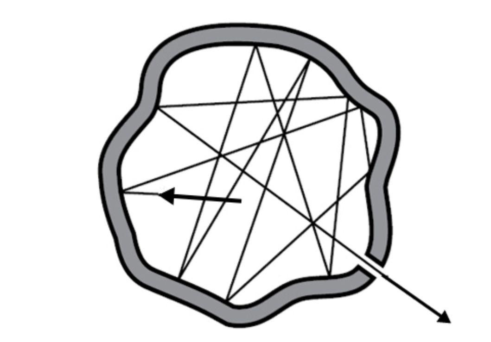

# 黑体辐射

## 量子化学：导论

你好呀～这是 **化学精通纳西妲**。  
今天，我们要开启第一节关于「量子化学」的课程——一个连光与能量都遵循奇妙微观法则的世界。  

在开始之前，我们需要先了解「量子」这个词的含义。  
你可能早就听说过它，对吧？是不是觉得它听起来有点未来感？比如「量子计算机」，就是现在非常热门的技术呢！  

不过，「量子」到底是什么意思呢？  
如果你想到「quantity（量）」这个词，那就非常接近了！「quantum」正是由它演变而来，意思是「某种事物的最小单位」。  
当你了解量子力学诞生的故事时，这个词就会变得清晰明了。  

## 普朗克之前（1900年之前）

让我们回到牛顿的时代，去看看一个让物理学家百思不得其解的问题——**黑体辐射**。  
**牛顿**早在他的著作《光学》中就提到过类似的现象：  

> "Do not black Bodies conceive heat more easily from Light than those of other Colours do, by reason that the Light falling on them is not reflected outwards, but enters the Bodies, and is often reflected and refracted within them, until it be stifled and lost?"  
>
> “黑色物体不是比其他颜色的物体更容易从光中产生热量吗？因为照射在黑色物体上的光不会向外反射，而是进入物体内部，并经常在物体内部反射和折射，直到被抑制和消失？”  

黑色的物体会吸收所有可见光，而不反射任何光。  
那么，光的能量被吸收后会怎样呢？能量应该守恒的。  
1858年，**Balfour Stewart** 发现黑体既能最强地吸收能量，也能最强地发射能量。  
一年后，**Gustav Kirchhoff** 进一步指出，黑体辐射的光谱只与温度有关，与材料本身无关。  
随后，科学家们提出了许多公式来描述这种神秘的发光现象。  
其中，**Wien（维恩）** 在1896年的公式与实验非常吻合：  

**维恩定律 (1896)**  
$$u(\nu,T)=a\nu^{3}e^{-b\nu/T}$$  
$u$: 单位体积、单位频率下的能量密度  
$\nu$: 频率  
$T$: 温度  
$a, b$: 常数  

1900年6月，**Rayleigh（瑞利）** 基于经典理论提出了另一个公式：  
**瑞利–金斯定律 (1900)**  
$$du(\nu,T)=\frac{8\pi\nu^{2}}{c^{3}}Ud\nu=\frac{8\pi\nu^{2}kT}{c^{3}}d\nu$$  
$c$: 光速 ($c=299792458~m/s$)  
$k$: 玻尔兹曼常数 ($k=1.380649×10^{−23}~J/K$)  

然而……事情出了问题。  
在高频区域，这个公式竟然预言能量会无限大！  
物理学家称之为 **「紫外灾难」**。  
  
瑞利–金斯定律在低频时准确，而维恩定律在高频时成立。  
但两者之间，却存在着一道无法跨越的鸿沟。  

---
## 量子物理的诞生

1900年12月，**马克斯·普朗克（Max Planck）** 灵光一闪：  
“如果光的能量不是连续的……而是由一个个微小能量包组成的呢？”  

他称这些最小能量单位为 **「量子（quantum）」**。  

**量子假设**  
$$E=n\epsilon=nh\nu$$  
$\epsilon$: 光的最小能量单元  
$h=6.62607015\times10^{-34}~J\cdot s$: 普朗克常数  
$\nu$: 频率  

这便是**量子物理的种子**。  
「量子」这个词，从此代表——**能量的离散单位**。  

## 普朗克定律

为了描述这些量子能量如何分布，普朗克引入了 **玻尔兹曼分布**：  

**玻尔兹曼分布**  
$$f(E)\propto e^{\frac{E}{kT}}$$  
$f(E)$: 拥有能量 $E$ 的粒子数  
$k$: 玻尔兹曼常数  
$T$: 温度  

通过推导，可以得到平均能量。这方法不是来自普朗克，是玻色与爱因斯坦的想法(1924)。  
$$<E>=<f(n\epsilon)>=\frac{\sum_{n=0}^{\infty}n\epsilon e^{-n\epsilon/kT}}{\sum_{n=0}^{\infty}e^{-n\epsilon/kT}}=\frac{\epsilon}{e^{\epsilon/kT}-1}=\frac{h\nu}{e^{h\nu/kT}-1}$$  
将其与常数结合，我们得到：  
**普朗克辐射定律（按频率表示）**  
$$du(\nu,T)=\frac{8\pi h\nu^{3}}{c^{3}}\cdot\frac{1}{e^{h\nu/kT}-1}d\nu$$  

**普朗克辐射定律（按波长表示）**  
$$du(\lambda,T)=\frac{8\pi hc}{\lambda^{5}}\cdot\frac{1}{e^{hc/\lambda kT}-1}d\lambda$$  

终于，一条方程连接了维恩定律与瑞利–金斯定律——理论与实验的和谐交响曲。

## 普朗克定律的验证

一条优秀的理论，必须经得起实验的考验。  
普朗克的方程完美解释了两条已知的经验定律：  

**斯特藩–玻尔兹曼定律 (1877)**  
*辐射功率与温度的四次方成正比*：  
$$M=\sigma T^{4}$$  

**维恩位移定律 (1896)**  
*辐射峰值波长与温度成反比*：  
$$\lambda_{peak}=\frac{b}{T}$$  

两者都可从普朗克定律中推导而来。  

### 斯特藩–玻尔兹曼定律的推导

对所有频率积分，可得总辐射能量：  
> $$\int du=\int_{0}^{\infty}\frac{8\pi h\nu^{3}}{c^{3}}\cdot\frac{1}{e^{h\nu/kT}-1}d\nu$$  
> 令 $x=h\nu/kT$，因此 $dx=hd\nu/kT$，可以进行变量替换：  
> $$\int_{0}^{\infty}\frac{8\pi k^{3}T^{3}}{h^{2}c^{3}}\cdot\frac{x^{3}}{e^{x}-1}\cdot\frac{kT}{h}dx$$  
> 这个积分的值是已知的：  
> $$\int_{0}^{\infty}\frac{x^{3}}{e^{x}-1}dx=\frac{\pi^{4}}{15}$$  
> 因此,  
> $$E=\int du=\frac{8\pi k^{3}T^{3}}{h^{2}c^{3}}\cdot\frac{\pi^{4}}{15}\cdot\frac{kT}{h}=\frac{8\pi^{5}k^{4}T^{4}}{15h^{3}c^{3}}$$  
> 这样，我们就得到了黑体辐射的总辐射能量（单位：$J/m^{3}$）。不过，斯特藩–玻尔兹曼定律讨论的是辐射功率（单位：$W/m^{2}$）。我们可以通过乘上 $c/4$，将体积能量转换为单位面积的辐射功率：
> $$M=E\cdot\frac{c}{4}=\frac{8\pi^{5}k^{4}T^{4}}{15h^{3}c^{3}}\cdot\frac{c}{4}=\frac{2\pi^{5}k^{4}T^{4}}{15h^{3}c^{2}}=\sigma T^{4}$$  

**斯特藩–玻尔兹曼定律**  
$$M=\sigma T^{4}=\frac{2\pi^{5}k^{4}}{15h^{3}c^{2}}T^{4}$$  
$$\sigma=\frac{2\pi^{5}k^{4}}{15h^{3}c^{2}}=5.67\times10^{-8}W/m^{2}\cdot K^{4}$$  
这个数值与实验结果完全吻合～  

### 维恩位移定律的推导

> 维恩位移定律（Wien’s displacement law） 描述的是在什么波长（或频率）下，黑体的辐射最强。  
> $$\frac{d(du/d\lambda)}{d\lambda}=0$$  
> 普朗克定律也可以用波长来表示：  
> $$\frac{du(\lambda,T)}{d\lambda}=\frac{8\pi hc}{\lambda^{5}}\cdot\frac{1}{e^{hc/\lambda kT}-1}$$  
> 为了简化方程，我们令 $\lambda=hc/xkT$，于是有 $d\lambda=-hcdx/x^{2}kT$。  
> $$du(x,T)=-\frac{8\pi x^{5}k^{5}T^{5}}{h^{4}c^{4}}\cdot\frac{1}{e^{x}-1}dx$$  
> 接下来，我们要找出使得下式成立的 $x$：  
> $$\frac{d}{dx}(\frac{x^{5}}{e^{x}-1})=\frac{5x^{4}(e^{x}-1)-x^{5}(e^{x})}{(e^{x}-1)^{2}}=0$$  
> 通过数值计算可以得到：  
> $$x=\frac{hc}{\lambda kT}\approx4.9651$$  
> 因此，这个关系可以写作：  
> $$\lambda_{peak}=\frac{b}{T}\approx\frac{hc}{4.9651kT}=\frac{2.90mm/K}{T}$$  

辐射强度的峰值波长为：  
**维恩位移定律**  
$$\lambda_{peak}=\frac{b}{T}\approx\frac{hc}{4.9651kT}=\frac{2.90mm/K}{T}$$  
温度越高，辐射峰值越短——  
所以，炽热的物体会从红光逐渐变为黄光、再到蓝白光。  

### $\nu\rightarrow0$

瑞利–金斯定律（Rayleigh–Jeans law） 能很好地解释低频情况下的实验结果。在低频极限下（$\nu$ 很小时），普朗克定律应当趋近于瑞利–金斯定律：  
> $$\lim_{\nu\rightarrow0}du(\nu,T)=\lim_{\nu\rightarrow0}\frac{8\pi h\nu^{3}}{c^{3}}\cdot\frac{1}{e^{h\nu/kT}-1}d\nu$$  
> 已知极限：  
> $$\lim_{x\rightarrow0}\frac{e^{x}-1}{x}=1$$  
> 因此方程可化为：  
> $$\lim_{\nu\rightarrow0}\frac{8\pi h\nu^{3}}{c^{3}}\cdot\frac{1}{e^{h\nu/kT}-1}d\nu=\frac{8\pi kT\nu^{2}}{c^{3}}d\nu$$  
当频率很小时，普朗克定律就会收敛为瑞利–金斯定律。  

### $\nu\rightarrow\infty$

而在高频极限下，维恩定律（Wien’s law） 则更符合实验结果。对于较大的频率 $\nu$，普朗克定律会收敛为维恩定律：  
> $$\lim_{\nu\rightarrow\infty}du(\nu,T)=\lim_{\nu\rightarrow\infty}\frac{8\pi h\nu^{3}}{c^{3}}\cdot\frac{1}{e^{h\nu/kT}-1}d\nu$$  
> 由于指数函数增长极快，我们可以近似认为 $e^{h\nu/kT}-1 \approx e^{h\nu/kT}$。
> $$\lim_{\nu\rightarrow\infty}\frac{8\pi h\nu^{3}}{c^{3}}\cdot\frac{1}{e^{h\nu/kT}-1}d\nu=\frac{8\pi h\nu^{3}}{c^{3}}\cdot e^{-h\nu/kT}d\nu=a\nu^{3}e^{-b\nu/T}$$  
因此，在高频时，普朗克定律的形式会非常接近维恩定律。  

---
---

## 普朗克的思考与启发

### 1900年10月：连接两种理论

普朗克注意到，维恩定律与瑞利–金斯定律各自只在特定范围内成立。  
他思考着——是否存在一种更深层的联系，使两者成为同一个真理的不同面貌呢？  

经过对热力学与熵的研究，他推导出了一条能够平滑连接二者的新方程。  

> 对于 维恩定律（Wien’s law） 而言，能量与频率和温度的关系是一个指数函数；而在 瑞利–金斯定律（Rayleigh–Jeans law） 中，能量则与温度成正比。  
> $$U_{Wien}\propto \nu e^{-b\nu/T}~(Wien)$$  
> $$U_{RJ}\propto T~(RJ)$$  
> 普朗克首先从热力学的角度来研究这个问题。热力学第一定律可以写作：  
> $$dU=TdS-PdV$$  
> 在黑体辐射实验中，实验装置是一个带有微小孔洞的封闭腔体，因此系统体积几乎不变。  
>   
> 因此可以简化为：  
> $$dU=TdS,~\frac{\partial S}{\partial U}=\frac{1}{T}$$  
> 普朗克分别考虑了两条定律下熵随能量的变化关系：  
> $$\frac{\partial S}{\partial U}=\frac{1}{T}\propto ln(U)~(Wien)$$  
> $$\frac{\partial S}{\partial U}=\frac{1}{T}\propto\frac{1}{U}~(RJ)$$  
> 那么，我们再对它求一次导数看看会发生什么呢？  
> $$\frac{\partial^{2} S}{\partial U^{2}}\propto\frac{1}{U}~(Wien)$$  
> $$\frac{\partial^{2} S}{\partial U^{2}}\propto\frac{1}{U^{2}}~(RJ)$$  
> 因此，可以把 $(\partial^{2} S/\partial U^{2})^{-1}$ 看作能量 $U$ 的多项式形式：  
> $$(\frac{\partial^{2} S}{\partial U^{2}})^{-1}\propto U~(Wien's)$$  
> $$(\frac{\partial^{2} S}{\partial U^{2}})^{-1}\propto U^{2}~(RJ)$$  
> 普朗克将两种形式结合起来：  
> $$(\frac{\partial^{2} S}{\partial U^{2}})^{-1}=C_{1}U+C_{2}U^{2}$$  
> 最终，他得出了这样的方程形式：  
> $$U=\frac{C_{1}C_{2}}{Ce^{C_{1}T}-1}$$  
> 其中，$C$ 是积分常数。普朗克在报告中给出了 $C=1$。  

### 1900年12月：能量的离散化

随后，普朗克借助玻尔兹曼的统计原理，假设腔体中的能量由无数「能量元」组成。  
$$\epsilon\epsilon\epsilon|\epsilon\epsilon|\epsilon|\epsilon\epsilon\epsilon|\epsilon\epsilon|\cdots$$  
$\epsilon$：能量元  

他用组合数学计算这些能量元的排列数：  
$$W=\frac{(P+N-1)!}{P!(N-1)!}$$  
$P=UN/\epsilon$: 能量粒子数量, $U$:一个光波的能量  
$N$: 光波数量  

> 因为 $N$ 的数值非常大，我们可以将 $N-1$ 近似为 $N$。
> 同时，当数值 $n$ 足够大时，阶乘可用斯特林公式近似表示为：  
> $$n!\approx\sqrt{2\pi n}(n/e)^{n}~(n\rightarrow\infty)$$  
> 由于 $n^{n}$ 相比 $\sqrt{n}$ 要大得多，因此可以写成：  
> $$W=\frac{(P+N-1)!}{P!(N-1)!}\approx \frac{(P+N)^{P+N}}{P^{P}N^{N}}$$  

并通过玻尔兹曼关系式与熵联系起来。  
$$S=k\cdot ln(W)$$  
$S$: 系的绝对熵量  
$W$: "*Wahrscheinlichkeit*", 微观状态数量  

> 让我们回忆一下热力学中的公式：  
> $$\frac{1}{T}=\frac{\partial S}{\partial U}=k\frac{\partial(ln(W))}{\partial U}$$  
> 我们已经得到了 $W$ 的近似形式，因此可以写出：  
> $$ln(W)=(P+N)ln(P+N)-Pln(P)-Nln(N)=\frac{N}{\epsilon}((U+\epsilon)ln(U+\epsilon)-\epsilon ln(\epsilon)-Uln(U))$$  
> 因此，  
> $$\frac{kN}{\epsilon}(ln(U+\epsilon)-ln(U))$$  
> 对于单个能量单元而言，其熵为：  
> $$\frac{k}{\epsilon}(ln(U+\epsilon)-ln(U))=\frac{1}{T}$$  
> 于是我们就得到了：  
> $$U=\frac{\epsilon}{e^{\epsilon/kT}-1}=\frac{hv}{e^{hv/kT}-1}$$  

最终，他得到了那个改变物理史的结果：  
$$U=\frac{\epsilon}{e^{\epsilon/kT}-1}=\frac{hv}{e^{hv/kT}-1}$$  

这正是普朗克那条著名的方程。  
它揭示了能量不是连续的，而是由一个个离散的量子组成的。  
从此，人类的目光第一次触及了量子世界的门槛——那一刻，知识的光，悄悄地在科学的夜空中亮起。  

光的能量，只能以 $h\nu$ 的整数倍存在。  
这标志着量子时代的黎明。  
人类第一次窥见了宇宙最微小的秘密。  

## References

Blackbody Radiation: Wikipedia (<https://en.wikipedia.org/wiki/Blackbody%20Radiation>)  
Planck's Law: Wikipedia (<https://en.wikipedia.org/wiki/Planck%27s%20Law>)  
Planck, M. (1900). Über eine Verbesserung der Wien’schen Strahlungsgleichung. *Verhandlungen der Deutschen Physikalischen Gesellschaft*.  
Planck, M. (1900). Zur theorie des gesetzes der energieverteilung im normalspektrum. *VhDPG*, 2, 238.  
