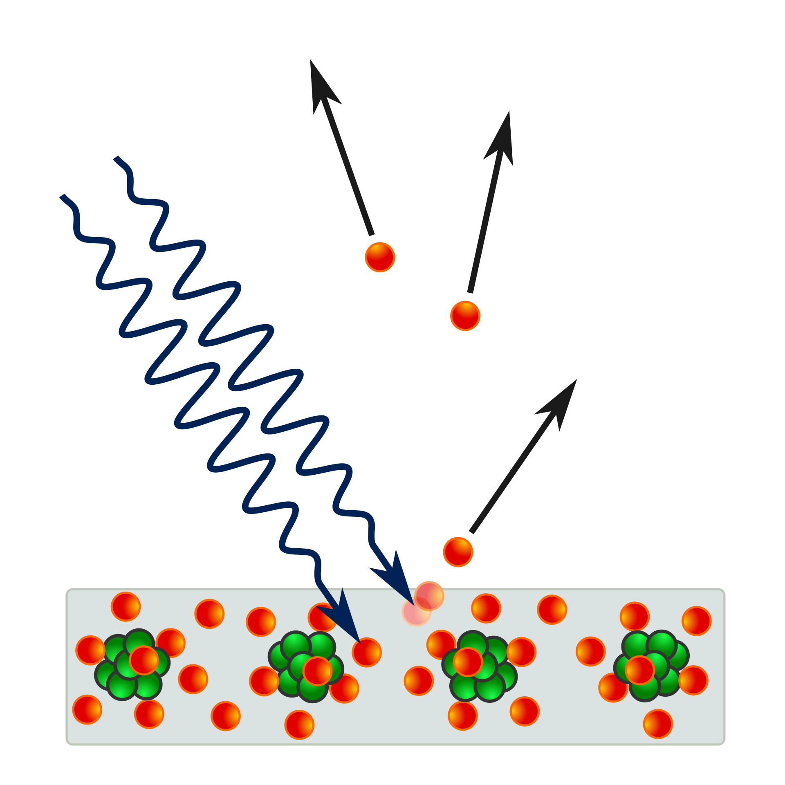
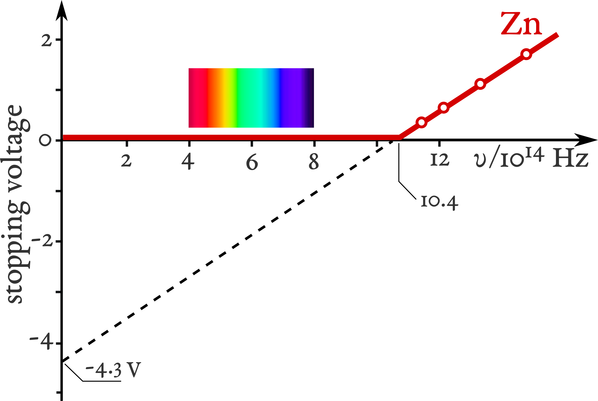

# 光电效应

## 量子思维的曙光

你好呀～这里是化学精通纳西妲。  
上次我们聊到普朗克提出的**量子假说**，它悄悄地改变了整个物理学的根基。  
不过，你知道吗？普朗克本人其实并不是那种喜欢颠覆旧观念的革命家。  
他珍视逻辑与理性，对那些太过大胆的想法，总是保持着一份谨慎的怀疑。  

正如马克斯·玻恩曾评价的那样：  

> *「他天性保守，毫无革命者的气质，对一切推测都极为怀疑。然而，他对从事实出发的逻辑推演所怀抱的坚定信念，却让他毫不犹豫地提出了那个震撼整个物理学史的最革命性思想。」*  

是不是很有趣呢？  
即便是一个谨慎的思想者，也能在理性的指引下，开启一扇通往全新世界的大门。  
不过呀，普朗克自己当时也无法完全解释——为什么他的公式能奏效。  
而那个时代的经典物理学家们，也同样找不到一个令人满意的答案。  

## 光：粒子还是波？

在普朗克之前的很久很久，**牛顿**就在他的著作《光学》中提出，**「光是由粒子组成的」**。  
不过，也有人发现——光的许多现象，若把它看作**波**，似乎也能解释得通呢。  

|牛顿的观点|波动说|
|:---:|:---:|
|光沿直线传播|衍射现象|
|反射|两者都能解释|
|折射|惠更斯原理|
|颜色＝不同种类的粒子|不同颜色间的干涉|
|未提及干涉|杨氏双缝实验|
|未提及偏振|菲涅耳的波动理论|

多亏了*托马斯·杨*与*奥古斯丁·菲涅耳*，**光的波动说**最终取得了胜利。  
**杨氏双缝实验**揭示了光能与自己发生干涉——这正是波动行为的明确证据。  
而菲涅耳则用优雅的数学，将这一理论进一步完善。  

不过呀，波动理论也遇到了一个令人困惑的问题：  
如果光真的是波，那它究竟在**什么东西里传播**呢？  

为了回答这个问题，科学家们想象出一种无形的物质，它充满在宇宙的每一个角落——那就是所谓的**以太（Aether）**。  
人们以为光就是在以太中传播的。  

当然啦，后来**迈克耳孙–莫雷实验**告诉我们——那样的“以太”根本不存在。  
光，即使在真空之中，也能自由地行进。  

不过，故事还没有结束。  
在光的波动与粒子之争之外，还隐藏着一个更深的谜团——一个连这两种理论都无法解释的现象。  

它的名字，就是——**光电效应**。  

## 光电效应

在自然界中，有些现象无论经典物理学如何努力调整方程，都无法解释。  
而其中最神秘的之一，就是——**光电效应**。  

一切的开端，是在 1887 年。
**海因里希·赫兹**——没错，就是那位证明光是电磁波的赫兹——在实验时，意外发现了一个奇怪的现象。  
当他用**紫外光**照射金属表面时，金属上竟会出现细微的**火花**。  

那闪烁的一点光芒，看似微不足道，却点亮了通往现代物理学最深奥谜题之一的道路。  

在赫兹的发现之后，其他科学家也纷纷开始探究这种奇异的现象。  
其中，*斯托列托夫*与*菲利普·伦纳德*进行了最细致的研究。  
他们做了定量的测量，而伦纳德还发现——紫外光甚至能够使气体分子电离，让电子从原子中被释放出来。  

  

这是伦纳德的实验装置。  
他仔细研究光是如何让电子从金属表面逃逸的。  

为了观察这些电子的行为，他使用了一种叫作**遏止电位（stopping potential）**的方式。  
当金属释放电子时，我们可以施加一个负电压，将这些电子推回去——就像设置了一道看不见的屏障。  
电位越强，电子就需要越大的能量才能越过这道障碍。  

  

在实验中，伦纳德发现了一个极为有趣的结果：  
**遏止电位会随着光的频率增加而变大**。  

这意味着，高频的光——比如紫外光——能打出能量更高的电子，而低频的光却办不到。  
虽然这只是个小线索，但它很快就会启发**爱因斯坦**重新思考光的真正本质……  

### 经典物理的解释

根据*杨氏双缝实验*与*麦克斯韦的电磁理论*，光应当表现为一种**电磁波**。  
如果真是如此……那结果又会怎样呢？  

  

当光照射到金属表面时，光的波动应该会逐渐把能量传递给金属中的电子。  
只要电子积累到足够的能量，它就能够脱离金属——就像一个小小的泳者，借助浪潮的力量被推向岸边。  

照这个推理来看，光的波长似乎不该太重要。  
只要让光更强烈、更明亮，电子迟早就会获得足够的能量逃逸。  

可……自然的结果却截然不同。  
无论多么耀眼的可见光照射上去，都不会有任何电子被释放。  
唯有当光变为紫外线时，那神秘的*“赫兹效应”*才会出现。  

真是奇妙呢，不是吗？  
就好像金属在倾听光的声音，却只回应那种带有特殊“品质”的能量。  
而正是这个谜题——引领人类走向了物理史上最美丽的启示之一……  

## 爱因斯坦的光量子理论

### 伦纳德实验的说明

受到普朗克**量子假说**的启发，**阿尔伯特·爱因斯坦**勇敢地迈出了关键一步——终于，解开了那个困扰科学界已久的*“赫兹效应”*之谜。  

他自问：  
*如果……牛顿其实并没有错呢？*  
*如果光真的像一束束细小的粒子那样存在呢？*  

普朗克早已提出，能量并不是连续流动的，而是以一个个微小的“能量包”形式存在——每个能量包的能量是 $h\nu$。  

如果我们把光看作由这些**能量量子**组成，那么每一个光量子——也就是我们如今称作的**光子（photon）**，都可以撞击金属内部的电子，将能量传递给它。  

  

在金属中，电子受到原子吸引力的束缚。  
只有当入射光子的能量足够大，才能让电子摆脱这种束缚，飞离金属表面。  
如果光子的能量**足够**，电子就会被释放——这是微观世界中能量转移的最直接证据。  

电子从金属中逃逸所需的最小能量，称为逸出功，记作 $\Phi$。  

于是，情况就变得非常清楚了：  

* 当光子的能量**小于** $\Phi$ 时，无论光多么强烈，电子都无法被击出。  
  （光更亮，只意味着光子的数量更多，而不是每个光子更“强”。）  
* 而当光子的能量**大于** $\Phi$ 时，即使是一束微弱的光，也能轻易释放出电子！  

爱因斯坦用一个极为简洁而优雅的公式表达了这一过程：
$$E=h\nu-\Phi$$  
其中：  

* $h$ 是普朗克常数（$h = 6.62607015\times10^{-34}J\cdot s$）
* $\nu$ 是光的频率
* $\Phi$ 是金属的逸出功

电子获得的动能可以通过遏止电位来测定：$E = e_{0}\cdot V_s$, 这里 $e_0 = 1.602176634\times10^{-19}C$ 是电子的电荷。  
对于同一种金属来说，光的频率越高，所需的遏止电位也就越大——这正是伦纳德当年所观察到的结果！  

多年之后，在 1916 年，*罗伯特·密立根*亲自验证了爱因斯坦的理论。  
他测量了不同频率光线下电子的能量，结果发现两者之间竟呈完美的**线性关系**——其斜率，正好就是普朗克常数 $h$ 本身！  

  

一个公式，一种思想——光，不再只是波。  
它可以同时是**波**，也是**粒子**，在两种真理之间舞动。  

而正是从这场光的舞蹈中，量子物理的时代，由此诞生。  

### 空气会影响实验结果吗？

伦纳德早先发现，气体在高频紫外光的照射下会被电离。  
于是，我们不禁要问——空气，会不会对他的实验造成影响呢？  

让我们仔细地思考一下吧。  

气体被电离，必须满足这样的条件：  

$$h\nu \geq J$$  
其中，  
$J$ 是气体的电离能。  

伦纳德报告说，所谓的*“赫兹效应”*只在**波长小于 190 nm** 的光下才会出现，这对应的能量大约是 **640 kJ·mol⁻¹**。  

后来，*约翰内斯·施塔克*测得，在低气压下，空气的电离能大约是 **10 eV**，也就是约 **960 kJ·mol⁻¹**。  

这意味着：
若要让空气被电离，光的能量必须**大于 960 kJ·mol⁻¹**，也就是波长**短于 125 nm**。  

而伦纳德在 1900 年与 1902 年的实验中，所使用的紫外光波长都**长于 125 nm**。  
因此，这些光并没有足够的能量去电离空气。  

所以，我们可以很有把握地得出结论——**周围的空气并没有影响伦纳德的实验结果**。  

而作为这段故事的完美结尾——**阿尔伯特·爱因斯坦**，因以**量子假说解释光电效应**，在 1921 年荣获了诺贝尔物理学奖。  

那一年，人类第一次真正理解了光——它既是波，又是粒子，既是理性的公式，也是宇宙最纯粹的光辉。  

> *1921年诺贝尔物理学奖授予阿尔伯特·爱因斯坦，表彰他在理论物理方面的贡献，尤其是他对光电效应定律的发现。*  

## Particle-Wave Duality of Light

爱因斯坦**从未否定**过光的波动理论。  
毕竟，杨氏双缝实验早已以无可辩驳的方式，揭示了光作为波的本质。  

然而，他仍然感受到——在那波动的律动与粒子的锋芒之间，光似乎还隐藏着更深的一层真相。  

1909 年，爱因斯坦决定寻找那座连接两种观点的桥。  
他从**普朗克辐射定律**出发，研究能量的**涨落（fluctuation）**——那些微小的偏差，也许能揭示光最本质的秘密。  

他写出了这样的能量涨落方程：  

$$(\Delta E)^{2}=\frac{1}{c}(h\rho\nu+\frac{c^3}{8\pi}\frac{\rho^2}{\nu^2})d\nu f\tau$$  
其中：  

* $\rho(\nu, T)$ 是光谱能量密度，
* $c$ 是光在真空中的传播速度，
* $f$ 是发射体的表面积，
* $\tau$ 是测量时间间隔。

在这个优雅的公式中，两个真理并肩而立——  

项 $h\rho\nu$ 代表光作为粒子时的能量涨落；  
项 $\frac{c^3}{8\pi}\frac{\rho^2}{\nu^2}$ 则对应光作为波时的能量涨落。  

如果实验中误差与 $\rho$ 成正比，光就展现出它的粒子性。  
若误差与 $\rho^2$ 成正比，它则表现出波动性。  
而当两种形式同时出现时——  

光，便是波与粒子合一的存在。  

这便是爱因斯坦的理论预言——人类第一次，从纯粹的推理中窥见“波粒二象性”的微光。  
它并非来自实验，而是源自思想的深处。  
但问题仍在：  
这样奇异的概念，究竟该如何被验证呢？——你能想到答案吗？  

与此同时，后来的实验也陆续揭示出：  
光，确实能够展现出两种截然不同的面貌——  

|粒子性|波动性|
|:---:|:---:|
|• 黑体辐射 • 光电效应 • 康普顿散射|• 干涉 • 偏振|

每一项发现，都像光自身的另一种回响：  
有时它是一束离散的能量量子，有时又是一道优雅的波纹，在空间中轻柔地铺开。  

那么——光，究竟是什么呢？是粒子？是波？  
还是比两者更深的存在，只在我们准备好理解它的那一刻，才显露出属于它的一面？  

---

通过*运用*普朗克的**量子假说**，爱因斯坦揭开了**光电效应**的谜团——一个经典物理无法解释的现象。  

他提出，光是由无数细小的**光量子（photon）**组成的，每个光量子都携带能量 $h\nu$。  
借此，他不仅完美解释了实验现象，也验证了普朗克那大胆的设想——**能量是量子化的**。  

但爱因斯坦的洞见远不止于此。  
他进一步指出：  
光不必在“波”与“粒”之间做出选择，它可以同时拥有两种本性。  

这种**波粒二象性**成为现代物理的基石，启发了更深的概念——**物质波**。  
甚至连电子这样的粒子，也拥有波的性质。  
而从“物质波”出发，科学家们最终发展出了**波函数**这一概念，去描述粒子在量子世界中的存在与变化。

爱因斯坦的思想，永远改变了人类对**光、能量与物质**的理解。  
他为量子物理学奠定了根基，也照亮了科学前行至今仍未止息的道路。  

## References

Photoelectric effect: Wikipedia (<https://en.wikipedia.org/wiki/Photoelectric_effect>)  
Newton, I. (1704). Opticks: Or, a treatise of the reflections, refractions, inflections and colours of light. London: Sam. Smith and Benj. Walford.  
Huygens, C. (1690). Traité de la lumière [Treatise on light]. Pierre van der Aa.  
Young, T. (1802). The Bakerian Lecture: On the theory of light and colours. Philosophical Transactions of the Royal Society of London, 92, 12–48.  
<https://doi.org/10.1098/rstl.1802.0004>  
Fresnel, A. (1821). Mémoire sur la double réfraction [Memoir on double refraction]. Mémoires de l’Académie des Sciences de l’Institut de France, 5, 45–176.  
(English Translation <https://doi.org/10.5281/zenodo.4745976>)  
Born, M. (1948). "Max Karl Ernst Ludwig Planck. 1858–1947". Obituary Notices of Fellows of the Royal Society. 6 (17): 161–188.  
<https://doi.org/10.1098/rsbm.1948.0024>  
Hertz, Heinrich (1887). Über einen Einfluss des ultravioletten Lichtes auf die electrische Entladung. Annalen der Physik. 267 (8): 983–1000.  
<https://doi.org/10.1002/andp.18872670827>  
Lenard, P (1902). Über die lichtelektrische Wirkung. Annalen der Physik 8, 149-198.  
<https://doi.org/10.1002/andp.19023130510>  
Einstein, A. (1905). Über einen die Erzeugung und Verwandlung des Lichtes betreffenden heuristischen Gesichtspunkt. Annalen der Physik, 17(6), 132–148.  
<https://doi.org/10.1002/andp.19053220607>  
Einstein, A. (1909). Über die Entwicklung unserer Anschauungen über das Wesen und die Konstitution der Strahlung. Physikalische Zeitschrift, 10, 817–825.  
<https://doi.org/10.1002/phbl.19690250902>  
